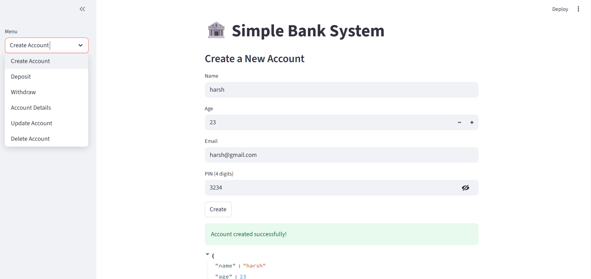

# 🏦 Simple Bank System (Streamlit)

A lightweight **Banking System Web App** built with **Python** and **Streamlit**.  
It provides essential banking operations like creating accounts, deposits, withdrawals, updating details, and deleting accounts.  
All data is stored locally in a JSON file, making it easy to run without setting up a database.  

---

## 🚀 Features
- **Account Management**: Create, view, update, and delete accounts  
- **PIN Authentication**: Secure login with 4-digit PIN  
- **Transactions**: Deposit and withdraw money with balance validation  
- **Randomized Account Number Generation**  
- **JSON Storage**: Data is stored in `data.json` for persistence  
- **Interactive Web UI** powered by Streamlit  

---

## 📸 Demo Screenshot
  

---

## 📂 Project Structure
📦 simple-bank-system
┣ 📜 bank_app.py # Main Streamlit app
┣ 📜 data.json # Auto-generated JSON database
┗ 📜 README.md # Documentation

yaml
Copy code

---

## ⚙️ Installation & Setup

1. **Clone this repository**
   ```bash
   git clone https://github.com/your-username/simple-bank-system.git
   cd simple-bank-system
Install dependencies

bash
Copy code
pip install streamlit
Run the app

bash
Copy code
streamlit run bank_app.py
Open in your browser at http://localhost:8501

🖥️ How It Works
Create Account: Enter name, age, email, and 4-digit PIN to create a new account

Deposit / Withdraw: Manage balance with amount validation (0 < amount ≤ 10000)

Account Details: View account info by providing account number and PIN

Update Details: Change name, email, or PIN securely

Delete Account: Permanently remove an account with confirmation

🔮 Future Enhancements
Add transaction history tracking

Use SQLite or MongoDB instead of JSON

Implement fund transfers between accounts

Add user authentication system with password hashing

Deploy online with Streamlit Cloud or Heroku

🧑‍💻 Author
Bishal Chettri
